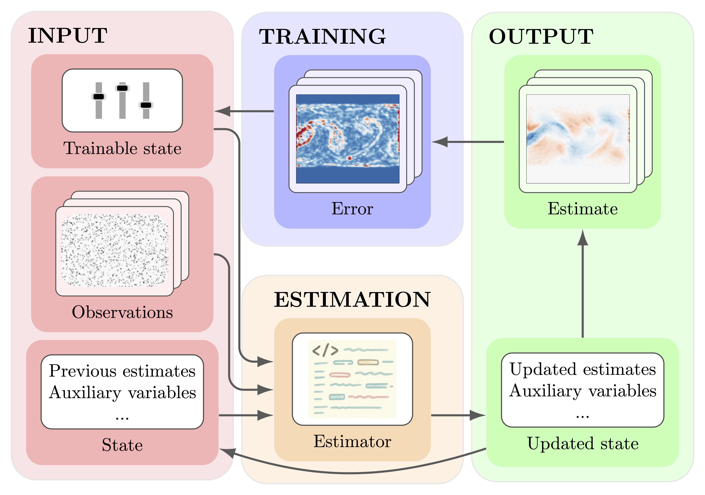

# Flow Gym: a research toolkit for flow-field quantification

[](https://arxiv.org/abs/2512.20642)
[](https://www.python.org/downloads/)
[](https://github.com/antonioterpin/flowgym/stargazers)
[](https://pypi.org/project/flow-gym-suite)
[](https://opensource.org/licenses/MIT)
[](https://github.com/astral-sh/uv)

FlowGym is a Python toolkit for developing, benchmarking, training, and
deploying flow-field quantification methods. It provides a standardized
estimator interface, JAX-first implementations, interoperable wrappers for
external methods, and shared workflows for repeatable evaluation and
training.



## What FlowGym provides

- Unified estimator construction through `flowgym.make`
- A shared `Estimator` interface for classical and learning-based methods
- Flow-field and density estimator implementations under `flowgym.flow` and
  `flowgym.density`
- JAX-native implementations together with wrappers for representative
  external libraries
- Training, evaluation, benchmarking, and comparison orchestration through
  `src/main.py`
- Cache-backed helpers for repeated dataset passes and expensive derived
  data

## Install

```bash
uv add flow-gym-suite
```

With `pip` instead:

```bash
pip install flow-gym-suite
```

For local repository work:

```bash
uv sync --group dev
```

## Minimal API example

```python
import jax
import jax.numpy as jnp

from flowgym.make import make_estimator

estimator_config = {
    "estimator": "dis_jax",
    "estimate_type": "flow",
    "config": {
        "jit": False,
        "preset": 1,
    },
}

image_shape = (1, 64, 64)
estimate_shape = (1, 64, 64, 2)

trained_state, create_state_fn, compute_estimate_fn, estimator = make_estimator(
    estimator_config=estimator_config,
    image_shape=image_shape,
    estimate_shape=estimate_shape,
    rng=0,
)

prev = jnp.zeros(image_shape, dtype=jnp.float32)
curr = jnp.ones(image_shape, dtype=jnp.float32)
state = create_state_fn(prev, jax.random.PRNGKey(0))
new_state, metrics = compute_estimate_fn(curr, state, trained_state)
```

This is the smallest public API loop in FlowGym. For repository-backed
examples, benchmarking workflows, and CLI usage, use the docs pages linked
below.

## CLI example

```bash
uv run python src/main.py \
  --mode eval \
  --estimator src/flowgym/config/estimators/flow/real_dis.yaml \
  --dataset src/flowgym/config/piv_dataset_class1_eval.yaml
```

## Documentation

The canonical human-facing docs start at [docs/index.md](docs/index.md).

- [Getting started](docs/getting-started/index.md)
- [Example workflows](docs/examples/index.md)
- [API reference](docs/api/index.md)
- [Architecture guide](docs/guides/architecture.md)
- [Contributing guide](docs/guides/contributing.md)
- [Project docs](docs/project-docs.md)

If you are new to the project, start with
[docs/getting-started/index.md](docs/getting-started/index.md) for the motivation,
installation paths, and first estimator example.

## Caching examples

The repository includes two documented caching walkthroughs:

- [DIS caching example](docs/examples/caching.md) backed by
  `examples/10_caching.py`
- [RAFT caching example](docs/examples/caching.md) backed by
  `examples/11_caching.py`

## Contributing

Contributions are welcome. For current setup, quality gates, docs workflow,
and repository navigation, use [docs/guides/contributing.md](docs/guides/contributing.md).

## Citation

If you use this code in your research, please cite:

```bibtex
@article{banelli2025flowgym,
   title={Flow Gym},
   author={Banelli, Francesco and Terpin, Antonio and Bonomi, Alan and D'Andrea, Raffaello},
   year={2025},
   journal={arXiv preprint arXiv:2512.20642}
}
```

## License

This project is licensed under the MIT License. See [LICENSE](LICENSE).
